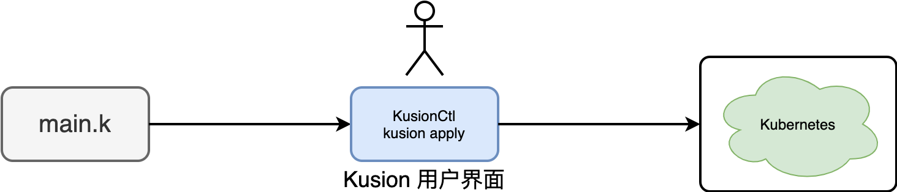

# 1.4 Kusion 用户界面

Kusion 一词来源于 fusion（意为融合） + kubernetes，是基于云原生基础设施，通过定义云原生可编程接入层，提供包括配置语言、模型界面、自动化工具、最佳实践在内的一整套解决方案，连通云原生基础设施与业务应用，连接定义和使用基础设施的各个团队，串联应用生命周期的研发、测试、集成、发布各个阶段，服务于云原生自动化系统建设，加速云原生落地。Kusion 引擎的终极目标是为了解决自动化运维：SRE 只是通过 KCL 语言 +Konfig 大库描述自己的业务终态，Kusion 引擎通过实时监控系统状态根据描述的状态响应规则进行运维操作。上层用户通过 Kusion 用户界面和 Kusion 引擎交互。

## 1.4.1 单 App 应用界面

Kusion 用户界面并不是仅仅指传统的网页控制台界面，它是用户在使用 Kusion 过程中直接感知的能力和功能界面。最简单的 Kusion 用户界面就是 [KusionCtl](https://kusionstack.io/docs/user_docs/support/faq-concepts#5-kusionctl) 命令行工具。

以上只是针对单 App 应用这种简单场景的关系图，用户只面对一个 Kusion 命令行工具。

## 1.4.2 规模化 App 应用界面

Kusion 最初是针对规模化 App 应用运维而开发的可编程配置技术栈。为了开发效率，Kusion 同时为 kusionctl 命令行提供了配套和的提效工具：KCL 命令、DevOps 工具、IDE 插件等。此外为了和开发系统集成，Kusion 同时也可针对 Github Action、Gitlab Action 和 ArgoCD 等系统配置对应的能力。因此更详细的 Kusion 用户界面如下图所示：

现在 Kusion 用户界面对应其中向左倒下的大写 L 形状的界面，包含本地工具和各种 CICD 集成的界面等。

## 1.4.3 不同角色和场景组合

在规模化运维中，经常需要涉及 App 和基础设施两个不同的应用场景，同时涉及开发者和 SRE 两种不同的角色，两种角色和两种场景产生的多种组合。不同角色的用户针对不同的场景分别开发 App Ops Config 和 Infra Ops Config，并统一到 Konfig 大库中进行开发和版本管理。这些配置最终构成了规模化运维涉及到各种配置代码，它们通过 Kusion 用户界面开发、测试，并最终通过各种 CICD 系统自动化 Apply 到最终目标平台。

## 1.4.4 本地工具和生态集成

KCL 命令行工具、DevOps 工具和 IDE 插件等本地工具用于提供原子的能力，同时方便本地开发工作。开发完成之后通过 Konfig 大库合并代码时触发各种 CICD 系统自动化 Apply 到最终目标平台。

<!--
自动化运维的关键是从配置到线上服务再到配置形成闭合的反馈线路，在ArgoCD系统中通过接入KusionSrv服务就可以实现对配置仓库到自动化修改（KCL语言的能力不仅仅提供配置，同时也可以将配置仓库作为元数据库进行增删改查）。在ArgoCD系统Kusion引擎的反馈流程如下图：

不过目前Kusion的引擎还在建设阶段，我们平时提到 Kusion，一般是对这一整套解决方案的统称；而 Kusion 生态工具链则包含了kcl命令行工具、KusionCtl命令行工具、KCL IDE插件等贯穿 Kusion 解决方案各个部分的自动化工具。目前Kusion引擎还工作在半自动化阶段，如下图所示：

上层的SRE用户通过Kusion提供的Konfig模型库描述终态，通过KusionCtl命令行工具进行diff仓库和线上系统差异，然后通过脚本进行半自动化运维工作。通过结合最佳的实践和CICD系统提供的辅助能力到KusionCtl命令，我们可以极大简化多集群集成、权限系统集成、风险系统集成等系统化运维等工作。这类只是对Kusion引擎设计思路的简要介绍，我们将在第3章详细介绍Kusion等整体架构和底层引擎的工作细节。
-->
