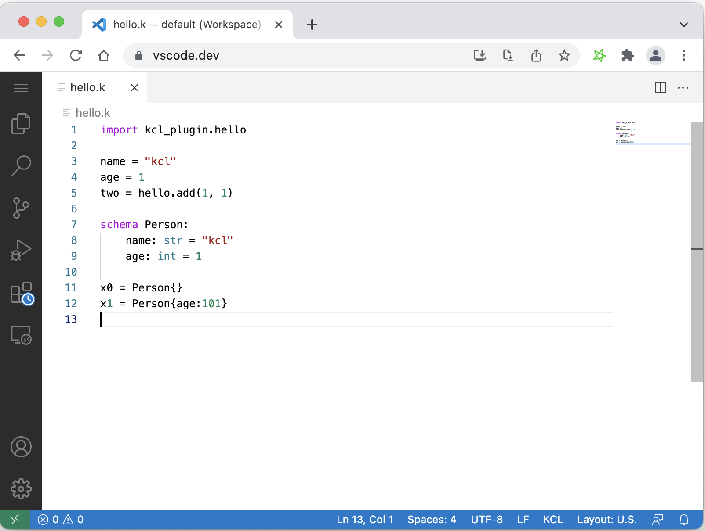

# 1.5 IDE 插件

为了提高 IDE 开发 KCL 的效率，Kusion 为 VS Code 在线版和本地版本提供了插件支持。在线版本可以从 [https://vscode.dev](https://vscode.dev) 地址打开，然后安装“KCL for vscode.dev 插件”，效果如下:

本地 VS Code 可以安装完整的 [KCL 插件](https://marketplace.visualstudio.com/items?itemName=kcl.kcl-vscode-extension)，提供了高亮、自动补全（部分：关键字补全等）、跳转、悬停、大纲等功能。插件虽然不是 Kusion 必须的部分，但是可以提高效率推荐安装。

<!--

KCL 生态系统为常用的编辑器提供了插件，帮助用户更加高效和无缝地进行 KCL 的开发。可选的平台有：

Visual Studio Code：KCL 扩展，提供对 KCL 编程语言的支持（重点维护中）

IntelliJ IDEA：KCL 插件，提供对 KCL 编程语言的支持

vim：计划中

## 1.5.1 Visual Studio Code 插件

### 1.5.1.1 插件安装

环境要求：VS Code 1.54+

安装：Extension -> 查询 "KCL" -> 安装，如图：

### 1.5.1.2 插件功能

高亮、自动补全（部分：关键字补全等）、跳转、悬停、大纲：

## 1.5.2 Intellij IDEA 插件

### 1.5.2.1 插件安装

环境要求：Intellij IDEA 2020.2+

安装：Intellij IDEA -> Preference -> plugins -> 查找 “KCL”：todo：示意gif（暂不支持从插件市场安装）

### 1.5.2.2 插件功能

高亮、自动补全（部分：导入路径的补全、关键字补全）、跳转、大纲：todo 示意 gif

-->
