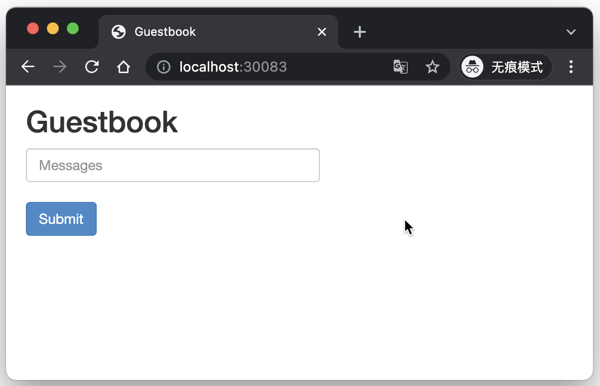

# 2.2 Apply 子命令

`kusion` 提供了一个 `apply` 子命令将当前 stack 中的一系列资源应用到运行时，它会根据 Konfig 堆栈中的 KCL 文件创建或更新或删除资源。 正如 `kubectl apply` 和 `terraform apply` 等子命令一样，对于基于声明式接口的系统 Apply 子命令通常用于生效配置操作，它也是 Kusion 的核心功能。本节展示 `kusion apply` 子命令的基本用法。

## 2.2.1 查看 apply 子命令帮助

Kusion 默认会生成执行计划，并最终交给用户确认执行。首先查看 `apply` 命令的帮助信息：

```shell
$ kusion apply -h
Apply a series of resource changes within the stack.

 Create or update or delete resources according to the KCL files within a Konfig stack. By default, Kusion will generate
an execution plan and present it for your approval before taking any action.

 You can check the plan details and then decide if the actions should be taken or aborted.

Examples:
  # Apply with specifying work directory
  kusion apply -w /path/to/workdir
  
  # Apply with specifying arguments
  kusion apply -D name=test -D age=18
  
  # Apply with specifying setting file
  kusion apply -Y settings.yaml
  
  # Skip interactive approval of plan details before applying
  kusion apply --yes

Options:
  -D, --argument=[]: Specify the arguments to apply KCL. Example: kusion apply -D name=test -D age=18 | kusion apply
--argument name=test,age=18
  -d, --detail=false: Automatically show plan details after previewing it
      --operator='': Specify the operator. Example: kusion apply -operator dayuan.ldy
  -O, --overrides=[]: Specify the configuration override path and value
  -Y, --setting=[]: Specify the command line setting files. Example: kusion apply -Y settings.yaml
  -w, --workdir='': Specify the work directory.
  -y, --yes=false: Automatically approve and perform the update after previewing it

Usage:
  kusion apply [flags] [options]

Use "kusion apply options" for a list of global command-line options (applies to all commands).
```

## 2.2.2 通过 `apply` 命令查看变更信息

在 `demo/dev` 目录下输入 `kusion apply` 命令查看执行计划：

```shell
$ kusion apply
 SUCCESS  Compiling in stack dev...

Stack: dev    Provider                Type              Name    Plan
      * ├─  kubernetes        v1:Namespace              demo  Create
      * ├─  kubernetes  apps/v1:Deployment           demodev  Create
      * └─  kubernetes          v1:Service  frontend-service  Create

Use the arrow keys to navigate: ↓ ↑ → ← 
? Do you want to apply these diffs?: 
  ▸ yes
    no
    details
```

在执行之前先切换到 `details` 选项回车查看详细信息：

```
✔ details
Use the arrow keys to navigate: ↓ ↑ → ← 
? Which diff detail do you want to see?: 
  ▸ all
    <kubernetes, v1:Namespace, demo> Create
    <kubernetes, v1:Service, frontend-service> Create
    <kubernetes, apps/v1:Deployment, demodev> Create
    cancel
```

可以查看新建的 Namespace、Service、Deployment 等资源。切换到 `all` 选项回车查看全部差异：

```
✔ details
✔ all

Provider: kubernetes
Type: apps/v1:Deployment
Name: demodev
Plan: Create
Diff: 
(root level)
± type change from <nil> to map
  - <nil>
  + id: 
    status: 
    attributes:
      apiVersion: apps/v1
      kind: Deployment
      metadata:
        name: demodev
        namespace: demo
      spec:
        replicas: 1
        selector:
          matchLabels:
            app.kubernetes.io/env: dev
            app.kubernetes.io/instance: demo-dev
            app.kubernetes.io/name: demo
            cluster.x-k8s.io/cluster-name: default
            tier: frontend
        template:
          metadata:
            labels:
              app.kubernetes.io/env: dev
              app.kubernetes.io/instance: demo-dev
              app.kubernetes.io/name: demo
              cluster.x-k8s.io/cluster-name: default
              tier: frontend
          spec:
            containers:
            - env:
              - name: GET_HOSTS_FROM
                value: dns
              - name: APP_NAME
                value: demo
              - name: ENVIRONMENT
                value: dev
              - name: INSTANCE
                value: demo-dev
              - name: CLUSTER
                value: default
              image: gcr.io/google-samples/gb-frontend:v4
              name: php-redis
              ports:
              - containerPort: 80
                protocol: TCP
              resources:
                limits:
                  cpu: 100m
                  ephemeral-storage: 1Gi
                  memory: 100Mi
                requests:
                  cpu: 100m
                  ephemeral-storage: 1Gi
                  memory: 100Mi
    private: {}
    dependsOn: []

Provider: kubernetes
Type: v1:Namespace
Name: demo
Plan: Create
Diff: 
(root level)
± type change from <nil> to map
  - <nil>
  + id: 
    status: 
    attributes:
      apiVersion: v1
      kind: Namespace
      metadata:
        name: demo
    private: {}
    dependsOn: []

Provider: kubernetes
Type: v1:Service
Name: frontend-service
Plan: Create
Diff: 
(root level)
± type change from <nil> to map
  - <nil>
  + id: 
    status: 
    attributes:
      apiVersion: v1
      kind: Service
      metadata:
        name: frontend-service
        namespace: demo
      spec:
        ports:
        - port: 80
        selector:
          app.kubernetes.io/env: dev
          app.kubernetes.io/instance: demo-dev
          app.kubernetes.io/name: demo
          cluster.x-k8s.io/cluster-name: default
          tier: frontend
        type: NodePort
    private: {}
    dependsOn: []
```

## 2.2.3 通过 `apply` 命令执行变更计划

在执行变更计划前需要确保本地可以链接到 Kubernetes 集群，如果是本地测试可以选择启动 Docker 自带的 Kubernetes 集群。

在 dev 目录下执行 `kusion apply` 命令，然后选择 yes 执行计划：

```
$ $ kusion apply
 SUCCESS  Compiling in stack dev...                                                                                                                        

Stack: dev    Provider                Type              Name    Plan
      * ├─  kubernetes        v1:Namespace              demo  Create
      * ├─  kubernetes  apps/v1:Deployment           demodev  Create
      * └─  kubernetes          v1:Service  frontend-service  Create

✔ yes
Start applying diffs......
 SUCCESS  Creating Namespace/demo
 SUCCESS  Creating Deployment/demodev
 SUCCESS  Creating Service/frontend-service
Creating Service/frontend-service [3/3] ██████████████████ 100% | 0s

Apply complete! Resources: 3 created, 0 updated, 0 deleted.
```

成功启动服务。

## 2.2.4 查看服务信息

`kusion apply` 命令启动的服务在 demo 名字空间下，也就是执行 `kusion init` 命令时指定的参数，保存在 `demo/project.yaml` 文件中。

我们可以通过 Kubernetes 自带的 kubectl 命令查看下产生了哪些 deploy：

```
$ kubectl get --namespace demo deploy
NAME      READY   UP-TO-DATE   AVAILABLE   AGE
demodev   1/1     1            1           12m
```

查看有哪些 pods：

```
$ kubectl get --namespace demo pods
NAME                       READY   STATUS    RESTARTS   AGE
demodev-6c85bfcc89-w67ns   1/1     Running   0          6m45s
```

查看有哪些 service：

```
$ kubectl get --namespace demo service
NAME               TYPE       CLUSTER-IP       EXTERNAL-IP   PORT(S)        AGE
frontend-service   NodePort   10.0.0.1         <none>        80:30083/TCP   10m
```

服务已经绑定到了宿主机器的 30083 端口，可以在浏览器打开 http://localhost:30083 查看：



说明服务已经正常启动。
