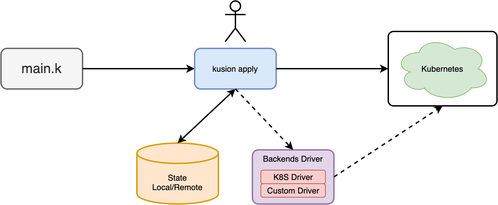

# 3.3 State & Backends

本节介绍 State & Backends，它们是 Kusion 引擎如何存储状态和对接不同平台的关键概念。

## 3.3.1 架构图

Kusion 工具的核心之一是一个结构化配置数据的状态按需执行框架引擎，其前端通过 KCL 开发的配置产出 YAML 等价的配置数据，然后通过可热插拔的后端执行引擎将 YAML 配置数据按需应用到不同的云原生平台。

## 3.3.2 State

State 用于存储资源下发后 Backend 驱动返回的状态，是对于 IaaS 状态的映射。用户执行 Apply 命令时，Kusion 会根据 Konfig 与 State 之间的差异，来按需执行资源创建、更新或删除操作。用户执行 Apply 命令后，Kusion 会根据 Backend 返回的信息更新 state 状态。

Kusion state 默认存储于"kusion_state.json"文件中，也可存储于远程后端，便于团队协作。

## 3.3.3 Backends

Kusion state 表示存储 Backend 状态的存储配置，默认情况下使用 Local 类型表示的本地磁盘存储状态。对于团队协作项目，State 可存储在远程服务上供多人共享使用。
