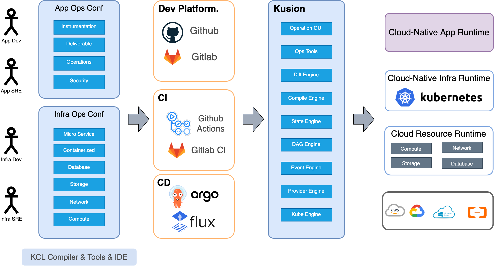

# 3.4 和上游下游的关系

Kusion 作为一个面向云原生的可编程配置技术栈并不是一个独立的技术孤岛，相反只有和整个生态的上下游工具协作配合才是最佳的实践。本节介绍 Kusion 和上游下游的关系。

## 3.4.1 协作关系图

从开发者和 SRE 开发维护配置、然后通过各种 CICD 系统对接到 Kusion 核心引擎，最终对接到目标平台。Kusion 整个工作流中和周边生态的协作关系图如下：

Kusion 涉及的上下游相关项目有：Kubernetes 自身及生态技术、Kubenetes 运维自动化技术、GitOps CICD 系统、IaaS 管理技术及各个云厂商和 IaC 领域语言及数据格式等。
