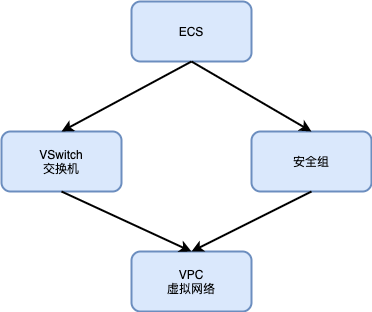
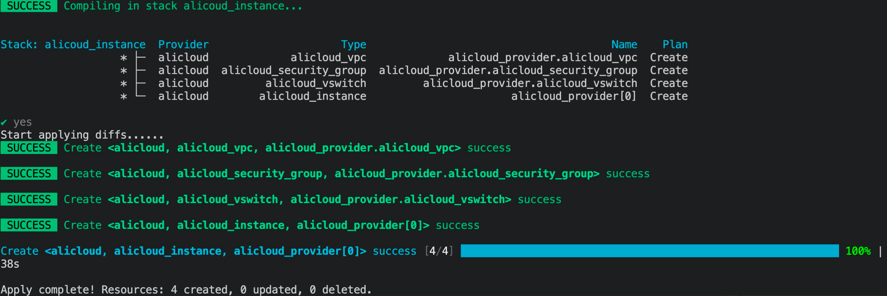

# 6.1 ECS 云主机

本文介绍如何使用 Kusion 创建一台 ECS 实例，以及必须的其他关联资源。

<!--
https://help.aliyun.com/document_detail/95829.html
-->

## 6.1.1 准备条件

在开始之前，您还需要一个阿里云账号和访问密钥（AccessKey）。 请在阿里云控制台中的 [AccessKey 管理页面](https://usercenter.console.aliyun.com/?spm=a2c4g.11186623.0.0.12321153zTjLcm#/manage/ak) 上创建和查看您的 AccessKey。

本节用到的阿里云资源在 Konfig 中的 `base.pkg.kusion_models.clouds.alicloud` 包定义（还在开发中，查看 [代码](https://github.com/KusionStack/konfig/tree/dev/yuanyi/add_aliyun_and_aws/base/pkg/kusion_models/clouds/alicloud)）。

要创建一个 ECS 机器，还需要创建对应的安全组和交换机，而安全组和交换机需依赖一个虚拟网络，它们的关系如图所示：



下面我们将通过 Kusion 配置代码化的方式构建以上需要的资源。

## 6.1.2 生成专有网络

专有网络 VPC（Virtual Private Cloud）是用户基于阿里云创建的自定义私有网络, 不同的专有网络之间二层逻辑隔离，用户可以在自己创建的专有网络内创建和管理云产品实例，比如 ECS、SLB、RDS 等。详细专有网络 VPC 创建信息查看 [阿里云 VPC 文档](https://help.aliyun.com/document_detail/65398.html#section-znz-rbv-vrx) 。

专有网络对应 `base.pkg.kusion_models.clouds.alicloud` 包定义的 `AlicloudVPC` 模型（TODO：参考链接）：

```py
schema AlicloudVPC:
    name?: str
    cidr_block?: str
    ...
```

目前只使用到 `name` 名称字段和 `cidr_block` IPv4 网段字段。然后初始化一个名称为 `alicloud_vpc`，子网地址为 `172.16.0.0/16` 的专有网络。

专业网络配置参数初始化代码如下：

```py
_vpc = alicloud.AlicloudVPC {
    name       = "alicloud_vpc"
    cidr_block = "172.16.0.0/16"
}
```

有了专有网络配置参数之后还需要通过阿里云提供的 Terraform Provider 实例化，类型 [`base.pkg.kusion_models.commons.provider_resource`](https://github.com/KusionStack/konfig/blob/develop/base/pkg/kusion_models/commons/provider_resource.k) 包定义。对应的 Kusion 代码如下：

```py
vpc = provider.Provider {
    providerName = "alicloud"
    resourceType = "alicloud_vpc"
    providerData = _vpc

    providerMeta = {
        region      = "cn-beijing"
        access_key  = "L****************3"
        secret_key  = "x****************o"
    }
}
```

其中 `alicloud` 和 `alicloud_vpc` 指定阿里云的 VPC 专有网络类型的资源；`_vpc` 是对应上面专业网络的配置；对应区域为 `cn-beijing`，还有对应的 AccessKey 信息。

## 6.1.3 生成交换机（VSwitch）

交换机（vSwitch）是组成专有网络的基础网络模块，用来连接不同的云资源。成功创建交换机后，您可以在交换机中创建云资源、绑定自定义路由表或者绑定网络 ACL。详细交换机使用信息查看 [阿里云使用交换机文档](https://help.aliyun.com/document_detail/65387.html#section-ts9-t3s-8vw) 。

交换机对应 `base.pkg.kusion_models.clouds.alicloud` 包定义的 `AlicloudVswitch` 模型（TODO：参考链接）：

```py
schema AlicloudVswitch:
    vpc_id: str

    name?: str
    availability_zone?: str
    cidr_block: str
    ...
```

目前需要的字段有 `vpc_id` 对应的专有网络、`name` 名称字段和 `availability_zone` 可用区、`cidr_block` IPv4 网段

初始化交换机配置参数如下：

```py
_vswitch = alicloud.AlicloudVswitch {
    vpc_id = "$kusion_path.registry.terraform.io/aliyun/alicloud.alicloud_vpc.alicloud_provider.alicloud_vpc.id"

    name              = "alicloud_vswitch"
    availability_zone = "cn-beijing-b"
    cidr_block        = "172.16.0.0/21"
}
```

需要注意的是 `vpc_id` 和前面创建的专有网络有关联关系。然后通过阿里云的 Provider 进行资源实例化：

```py
vswitch = provider.Provider {
    providerDependOn = [
        "registry.terraform.io/aliyun/alicloud.alicloud_vpc.alicloud_provider.alicloud_vpc"
    ]

    providerName = "alicloud"
    resourceType = "alicloud_vswitch"
    providerData =  _vswitch

    providerMeta = {
        region      = "cn-beijing"
        access_key  = "L****************3"
        secret_key  = "x****************o"
    }
}
```

通过 providerDependOn 定义交换机创建依赖专有网络的创建的依赖关系。其他的可用区和 AccessKey 等参数和专有网络实例化类似。

## 6.1.4 生成安全组（SecurityGroup）

安全组是 ECS 实例的虚拟防火墙，用于设置单个或多个 ECS 实例的网络访问控制，每台 ECS 实例至少需要属于一个安全组。详细安全组创建信息查看 [阿里云安全组创建文档](https://help.aliyun.com/document_detail/25468.html) 。

交换机对应 `base.pkg.kusion_models.clouds.alicloud` 包定义的 `AlicloudSecurityGroup` 模型（TODO：参考链接）：

```py
schema AlicloudSecurityGroup:
    vpc_id?: str

    name?: str
    description?: str
    ...
```

目前需要的字段有 `vpc_id` 对应的专有网络、`name` 名称字段和 `description` 描述字段。

初始化安全组配置参数如下：

```py
#create secutirygroup 
_security_group = alicloud.AlicloudSecurityGroup {
    vpc_id = "$kusion_path.registry.terraform.io/aliyun/alicloud.alicloud_vpc.alicloud_provider.alicloud_vpc.id"

    name        = "alicloud_security_group"
    description = "alicloud-security-group"
}
```

需要注意的是 `vpc_id` 和前面创建的专有网络有关联关系。然后通过阿里云的 Provider 进行资源实例化：

```py
security_group = provider.Provider {
    providerDependOn = [
        "registry.terraform.io/aliyun/alicloud.alicloud_vpc.alicloud_provider.alicloud_vpc"
    ]

    providerName = "alicloud"
    resourceType = "alicloud_security_group"
    providerData = _security_group

    providerMeta = {
        region     = "cn-beijing"
        access_key = "L****************3"
        secret_key = "x****************o"
    }
}
```

通过 providerDependOn 定义安全组创建依赖专有网络的创建的依赖关系。其他的可用区和 AccessKey 等参数和专有网络实例化类似。

## 6.1.5 生成 ECS 实例

云服务器 ECS（Elastic Compute Service）是阿里云提供的性能卓越、稳定可靠、弹性扩展的 IaaS（Infrastructure as a Service）级别云计算服务。详细云服务器信息查看 [阿里云实例创建](https://help.aliyun.com/document_detail/87190.html) 。

交换机对应 `base.pkg.kusion_models.clouds.alicloud` 包定义的 `AlicloudInstance` 模型（TODO：参考链接）：

```
schema AlicloudInstance:
    availability_zone?: str

    vswitch_id?: str
    security_groups: [str]

    image_id: str
    instance_type: str
    instance_name?: str
    password?: str
    ...
```

其中 `vswitch_id` 引用交换机 `id` 字段，`availability_zone` 引用安全组 `id` 字段（依赖安全组的创建）。`image_id` 为镜像的 ID、`instance_type` 为机器的类型、`instance_name` 为机器的名字、`password` 是可选的参数。

初始化 ECS 配置参数如下：

```py
_instance = alicloud.AlicloudInstance {
    availability_zone = "cn-beijing-b"

    vswitch_id = "$kusion_path.registry.terraform.io/aliyun/alicloud.alicloud_vswitch.alicloud_provider.alicloud_vswitch.id"
    security_groups = [
        "$kusion_path.registry.terraform.io/aliyun/alicloud.alicloud_security_group.alicloud_provider.alicloud_security_group.id"
    ]

    instance_type = "ecs.n2.small"
    image_id      = "ubuntu_18_04_64_20G_alibase_20190624.vhd"
    instance_name = "kusion-alicloud-instance"
    password      = "Demo1234fd"
}
```

需要注意的是 `vswitch_id` 和 `security_groups` 等配置对其他资源的依赖关系。然后通过阿里云的 Provider 进行资源实例化：

```py
instance = provider.Provider {
    providerDependOn = [
        "registry.terraform.io/aliyun/alicloud.alicloud_vswitch.alicloud_provider.alicloud_vswitch",
        "registry.terraform.io/aliyun/alicloud.alicloud_security_group.alicloud_provider.alicloud_security_group"
    ]

    providerName = "alicloud"
    resourceType = "alicloud_instance"
    providerData = _instance

    providerMeta = {
        region     = "cn-beijing"
        access_key = "L****************3"
        secret_key = "x****************o"
    }
}
```

通过 providerDependOn 定义安全组创建依赖专有网络的创建的依赖关系。其他的可用区和 AccessKey 等参数和专有网络实例化类似。

## 6.1.6 执行 Apply

执行 `kusion apply` 命令创建资源：



然后运行 `ssh root@<publicip>`，并输入密码来访问 ECS 实例。
