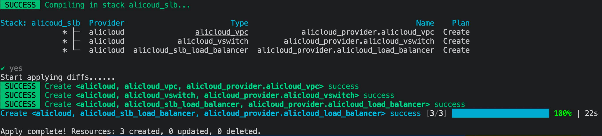

# 6.2 SLB 负载均衡

本文介绍如何使用 Kusion 创建负载均衡。

<!--
https://help.aliyun.com/document_detail/111830.html
https://help.aliyun.com/document_detail/111634.html
-->

## 6.2.1 准备条件

在开始之前，您还需要一个阿里云账号和访问密钥（AccessKey）。 请在阿里云控制台中的 [AccessKey 管理页面](https://usercenter.console.aliyun.com/?spm=a2c4g.11186623.0.0.12321153zTjLcm#/manage/ak) 上创建和查看您的 AccessKey。

本节用到的阿里云资源在 Konfig 中的 `base.pkg.kusion_models.clouds.alicloud` 包定义（还在开发中，查看 [代码](https://github.com/KusionStack/konfig/tree/dev/yuanyi/add_aliyun_and_aws/base/pkg/kusion_models/clouds/alicloud)）。

## 6.2.2 负载均衡

阿里云 [负载均衡 SLB（Server Load Balancer）](https://help.aliyun.com/product/27537.html) 是一种对流量进行按需分发的服务，通过将流量分发到不同的后端服务来扩展应用系统的服务吞吐能力，并且可以消除系统中的单点故障，提升应用系统的可用性。

专有网络对应 `base.pkg.kusion_models.clouds.alicloud` 包定义的 `AlicloudSLB` 模型（TODO：参考链接）：

```py
schema AlicloudSLB:
    name?: str
    load_balancer_name?: str
    load_balancer_spec?: str

    address_type?: str
    internet_charge_type?: str
    vswitch_id?: str
    ...
```

负载均衡同样要依赖交换机和专有网络，具体可以参考 6.1 节内容，这里不再重逢。负载均衡配置参数初始化代码如下：

```py
_slb = alicloud.AlicloudSLB {
    name = "alicloud_load_balancer"

    load_balancer_name = "alicloud_load_balancer"
    load_balancer_spec = "slb.s1.small"

    address_type         = "intranet"
    internet_charge_type = "PayByTraffic"
    vswitch_id           = "$kusion_path.registry.terraform.io/aliyun/alicloud.alicloud_vswitch.alicloud_provider.alicloud_vswitch.id"
}
```

然后通过阿里云的 Provider 进行资源实例化：

```py
slb = provider.Provider {
    providerDependOn = [
        "registry.terraform.io/aliyun/alicloud.alicloud_vswitch.alicloud_provider.alicloud_vswitch"
    ]

    providerName = "alicloud"
    resourceType = "alicloud_slb_load_balancer"
    providerData = _slb

    providerMeta = {
        region     = "cn-beijing"
        access_key = "L****************3"
        secret_key = "x****************o"
    }
}
```

通过 providerDependOn 定义负载均衡创建依赖专有网络的创建的依赖关系。其他的可用区和 AccessKey 等参数和专有网络实例化类似。

## 6.2.3 执行 Apply

执行 `kusion apply` 命令创建资源：



打开 Web 页面查看负载均衡信息：


说明创建成功。
